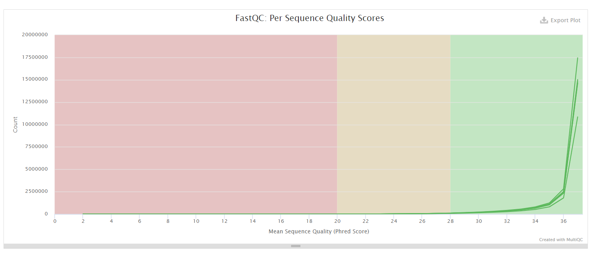

# hse21_hw3

## Выполнил Архипов Д. А. (2 группа)

Ссылка на colab: https://colab.research.google.com/drive/16mq0Pj7JtBVhuVAKnj4MPe_njvfyhyKX#scrollTo=IMvdwqr0_BA1

SRR3414629: 18375888 - 1604107 - 722172 = 16049609  
SRR3414630: 13186139 - 1240295 - 480520 = 11465324  
SRR3414631: 20928945 - 1700354 - 819740 = 18408851  
SRR3414635: 18428317 - 1392186 - 760134 = 16275997  
SRR3414636: 17825380 – 1332692 – 735108 = 15757580  
SRR3414637: 17844858 - 1397650 - 710230 = 15736978  

### Таблицы

### Скриншоты multiqc

### Скриншоты графиков

